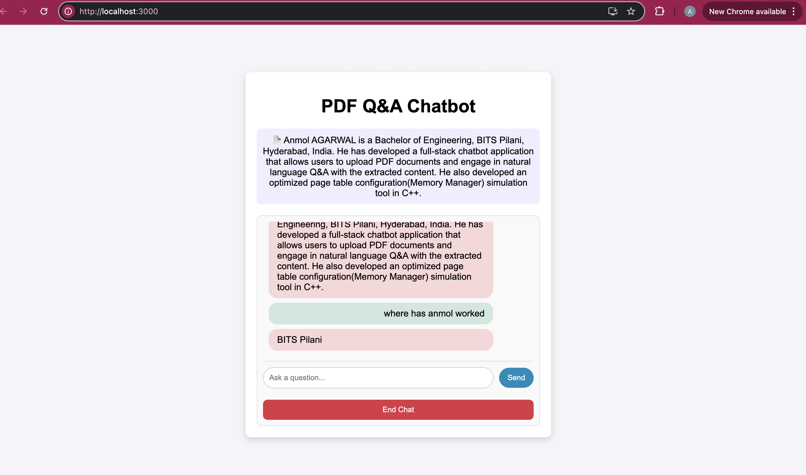

# PDF-QA App

## Image 1


## Image 2



This project is a **PDF Question Answering** application where users can upload a PDF, get a summary, and interact with the document using AI-generated answers based on its content.

## Prerequisites

- **Docker**: Ensure Docker is installed on your machine to run the application.
- **Hugging Face API Key**: You will need a Hugging Face API key to use their models for summarization and question answering. You can get it from [Hugging Face](https://huggingface.co).
- **SQLite Database**: The application uses SQLite, and you need to specify the database URL.

## Getting Started

### 1. Clone the Repository

First, clone the repository to your local machine:

1. **clone and move inside the directory**


    ```bash
     git clone https://github.com/ANMOL0804/pdf_qa_application.git
   

### 2. Set Environment Variables

To run the app locally, you need to rename .env.example to .env and set two environment variables inside:

- **`HF_API_KEY`**: Your Hugging Face API key for accessing the summarization and question-answering models.
- **`DATABASE_URL`**: The URL for the SQLite database used by the application(sqlite:///./session_data.db for local storage).

#### Steps:

1. **set .env.example to .env**
   

   ```bash
     mv backend/.env.example backend/.env

2. **set the environment variables**


### 3. Build and Run with Docker:

To run the app locally using Docker, we will use **Docker Compose** to set up both the backend and frontend services.

1. **Build the containers**
   From the root directory of the project (where the `docker-compose.yml` file is located), run the following command to build the Docker containers for both backend and frontend:

       
       docker-compose build

### 4. Start the Containers

After successfully building the Docker containers, you can start them with the following steps:

1. **Start the containers in the foreground**:

   To start both the frontend and backend containers and see their logs in the terminal, run:
      ```text
      docker-compose up

### 4. Access the Application

Once the Docker containers are up and running, you can access the application in your web browser:

- **Frontend**: The frontend React app will be available at the following URL:

  ```text
  http://localhost:3000


### Backend Access

The backend of the application is built with **FastAPI** and can be accessed through the following steps:

 **Backend API URL**:
   Once the Docker containers are running, the backend FastAPI application will be available at:

   ```text
   http://localhost:8000
